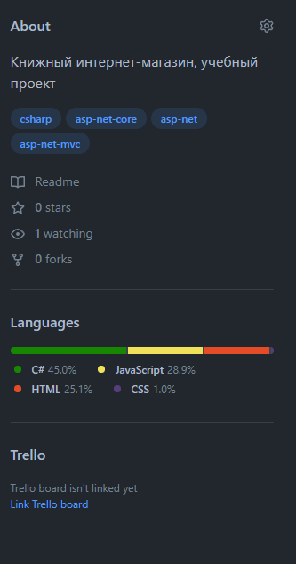
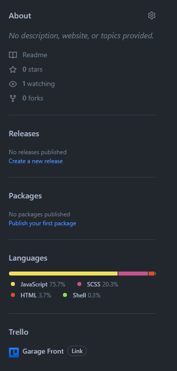
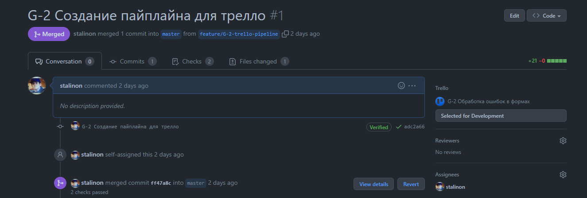

### Google Chrome extension for integrating Trello service into Github

To install the extension, run `npm run build` at the root of the repository, then upload the `build` folder like a Chrome extension.

The extension automatically attaches cards to pull requests on the connected Trello board (the task naming pattern is a string like "TASK-12 This text could be different for PR and card"). It allows you to move them to other lists from the pull request page using a `select`.

In addition, the connection of the board occurs after the entering of only `API_KEY` and `API_TOKEN` Trello, further linking is also implemented by the `select`.

---

### Расширение Google Chrome для интеграции сервиса Trello в Github

Чтобы установить расширение, запустите `npm run build` в корне репозитория, затем загрузите папку `build`, как расширение Chrome.

Расширение автоматически прикрепляет карточки к пулл-реквестам на подключенной доске Trello (паттерн названия задачи представляет собой строку вроде «TASK-12 Этот текст может отличаться для PR и карточки»). Это позволяет вам перемещать их в другие списки со страницы пулл-реквеста с помощью `селекта`.

Кроме того, подключение доски происходит после введения только `API_KEY` и `API_TOKEN` Trello, дальнейшее подключение также осуществляется с помощью `селекта`.

